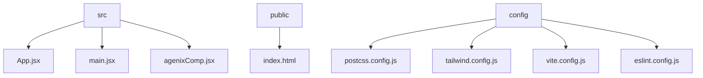

# Agenix Site Landing Site

## 🗂️ Description

The Agenix Site Landing Site is a React-based landing page for the Agenix product or service. This project aims to provide a visually appealing and informative website that showcases the features and benefits of Agenix. The site is built using modern web technologies, including React, Vite, and Tailwind CSS, ensuring a fast, responsive, and engaging user experience.

## ✨ Key Features

### **Core Features**

* **Agenix Landing Page**: A custom-designed landing page component (`AgenixLandingPage`) that includes a header, hero section, features section, and footer.
* **Responsive Design**: The site is built using Tailwind CSS, ensuring a responsive design that adapts to various screen sizes and devices.

### **Technical Features**

* **React**: Built using React, a popular JavaScript library for building user interfaces.
* **Vite**: Uses Vite as the build tool, providing fast and efficient development and production builds.
* **Tailwind CSS**: Employs Tailwind CSS as the utility-first CSS framework for styling and layout.

## 🗂️ Folder Structure

## 🛠️ Tech Stack

## ⚙️ Setup Instructions

To run the project locally:

* Clone the repository: `git clone https://github.com/ISOLATEDMAN/agenix-site_landing-site.git`
* Navigate to the project directory: `cd agenix-site_landing-site`
* Install dependencies: `npm install`
* Start the development server: `npm run dev`

Open your web browser and navigate to `http://localhost:5173` to view the site.

## 📁 Configuration Files

The project uses several configuration files:

* `postcss.config.js`: PostCSS configuration file that defines plugins for processing CSS.
* `tailwind.config.js`: Tailwind CSS configuration file that defines how the utility-first CSS framework should be used in the project.
* `vite.config.js`: Vite configuration file that sets up the build tool for the project.
* `eslint.config.js`: ESLint configuration file that defines rules and settings for code linting.

  

<h3>Kartikeya Samudrala</h3>

I Build MVP apps

 

  <a href="https://gitfull.vercel.app">Made by GitFull</a>

    